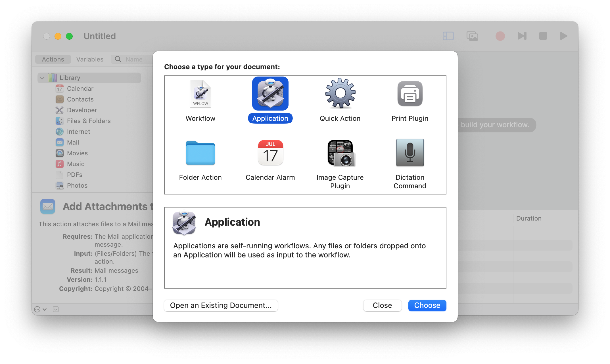
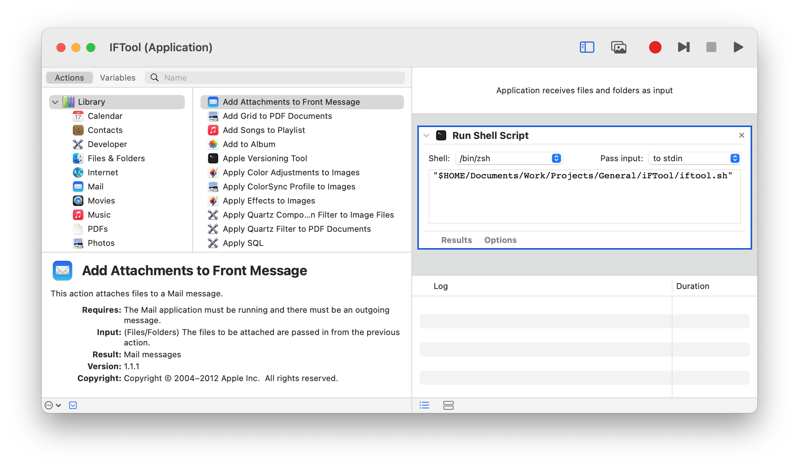

# iFTool

Script to run [IFTool](smb://data.ift.tuwien.ac.at/30_IT/01_IFT_Tool) on macOS using CrossOver

This tool basically automates the following tasks

1. Opens a VPN tunnel to TU Vienna, if your computer does not use an internal IP (`128.130.106.…`) address, i.e. your computer is not connected via Ethernet to the (IFT part) of the university network
2. Mount the SMB volume that contains the IFTool
3. Opens the IFTool using CrossOver
4. Cleans up resources:

   - Closes VPN tunnel
   - Unmounts SMB share
   - Closes CrossOver

   after you closed the IFTool

[CrossOver]: https://www.codeweavers.com/crossover

## Requirements

- [CrossOver](https://www.codeweavers.com/crossover)

## Preparation

### CrossOver

The preparation steps below should be the same, regardless of if you want to use the IFTool manually or use this script:

1. Open the CrossOver application
2. Go to “CrossOver” → “Settings…” (<kbd>⌘</kbd> + <kbd>,</kbd>)
3. Disable “Launch Installer Assistant when CrossOver opens a .exe file”

   

4. Create a new bottle
   1. Select “Bottle” → “New Bottle…”
   2. Choose a name of your liking e.g. “IFTool”
   3. Choose “Windows 10 64-Bit” as Bottle type
5. Optional: Enable “High Resolution Mode” for your Bottle

If you want to use the IFTool manually, then the only thing left is to mount:

```
smb://data.ift.tuwien.ac.at/30_IT/01_IFT_Tool
```

in Finder (<kbd>⌘</kbd> + <kbd>K</kbd>) and open `IFT_Tool.exe` with the CrossOver application. If you want to use the script, then please read on.

### Script

The script assumes that your VPN network configuration for the university is called `TU Vienna`. If that is not the case, then please replace `TU Vienna` with the name of your [TU Vienna VPN configuration](https://www.it.tuwien.ac.at/en/services/network-infrastructure-and-server-services/tunet/vpn-virtual-private-network) or rename your VPN configuration to “TU Vienna”.

## Usage

Please use the following command inside the root of this repository

```sh
./iftool.sh
```

## GUI Launcher

If you want you can also create a very basic application with Automator that launches the script contained in this repository. This way you only need to double click the application icon and do not need to open Terminal to run the script.

1. Open Automator
2. Select “Application” and click on “Choose”:

   

3. Drag (and drop) the “Run Shell Script” action into the workflow
4. Choose `/bin/zsh` as Shell and “Pass input: to stdin”
5. Add the path to the script `iftool.sh` on your computer. For example, if your script is stored inside the directory `Documents/Work/Projects/General/iFTool` inside your home folder, then paste the text:

   ```
   "$HOME/Documents/Work/Projects/General/iFTool/iftool.sh"
   ```

   into the action:

   

6. Store the application (<kbd>⌘</kbd> + <kbd>S</kbd>) as “IFTool”
7. Optional: Change the icon

   1. Copy the file [`ApplicationStub.icns`](Pictures/ApplicationStub.icns)
   2. Navigate to the directory where you stored the application from step 5.
   3. Right click on the application and choose “Show Package Contents”
   4. Go to the subdirectory `Contents/Resources`
   5. Paste `ApplicationStub.icns` to overwrite the generic Automator application icon

## Known Problems

- No pictures in “Mitarbeiterinformationen” (“Extras” → “Telefonnummern” <kbd>Ctrl</kbd> + <kbd>T</kbd>)
- Items in “Hilfe” menu do not work (e.g. “Hilfe” → “IFT_Tool allgemein”); Workaround: Link to [SMB share containing help documents](smb://data.ift.tuwien.ac.at/01_IFT/40_Informationen-f%C3%BCr-neue-MA))
